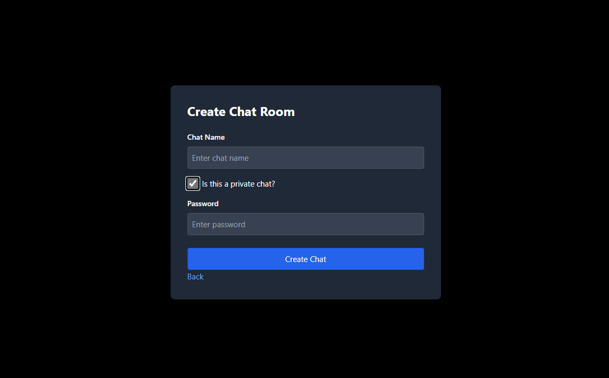
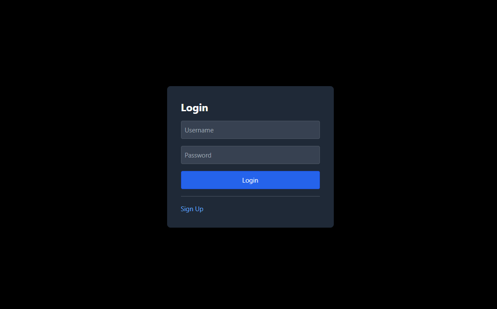

# Chat App

## Features:
- User authentication (signup & login)
- Public rooms
- Private rooms (password)
- Realtime chat
- Sending images (bugs?)

## Tech Stack:
- front end client - in `/client`
- back end - in `/server`

### Front end:
- VUE.js
- TypeScript

### Back end:
- NodeJS express app
- Sockets
- Postgres (DB)

## Gallery:
Chat page 

Create page 

Login page 
